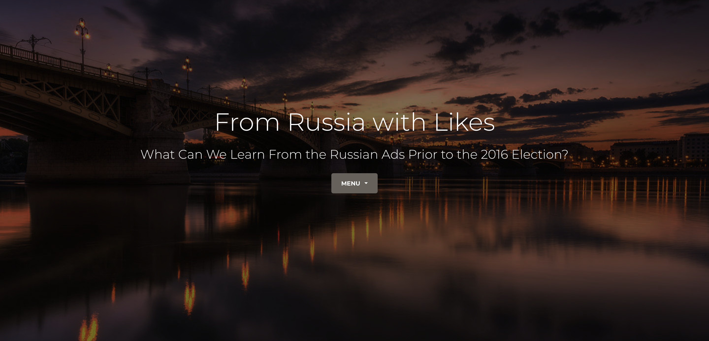

# IRA_Ads

“America, we have a problem,” said Representative Jackie Speier, a California Democrat who sits on the House committee. “We basically have the brightest minds of our tech community here and Russia was able to weaponize your platforms to divide us, to dupe us and to discredit democracy.”

   In 2016, the Internet Research Agency, the group of so called Russian “trolls”, put out advertisements that could be found on many of the most popular social media platforms.  Many speculated that the purpose for these ads was to meddle in the 2016 Presidential Election, and it was believed by some such as Jackie Speier, that the ads were meant to divide the U.S population along particular issues and beliefs.

   My interest in these advertisements is two sided.  On the one hand, I think its very interesting to take these ads and look at who they are being targeted to and if there are any underlying patterns present.  The second area of interest is from more of a marketing mindset.  I wanted to know which of these ads are getting the most clicks, and what features or factors could be associated with higher click rates.

   A set of about 3500 advertisements was released by the House Intelligence Committee in May of this year(2018).  These advertisements were seperated into text with pdftotext by a github user russian-ad-explorer and put into a json file.

   In analyzing the data, I first assembled some general statistics about the advertisements and grouped them by the interest categories that they were targeted towards.  I found what I considered to be the most interesting interest groups based on the number of ads, the number of total clicks, and the amount of money that was spent advertising towards that interest group.

   After I found the most pertinent groups, I decided to look at what factors would get some ads more clicks than others, and focused on the words contained in the body of the ads’ text.  Using Natural Language Processing techniques, vectorized the ads to reflect the presence and frequency of certain words.  For each interest category I picked, I created a model that predicted the probability of the words in an advertisement being targeted towards a particular interest group.  This has somewhat limited applications due to number of samples for some of the groups, but nonetheless yielded interesting results.  Certain words could be seen to have a higher probability of being present in ads targeted towards certain groups.

   In addition, for each interest group I selected, I created a model that modeled which words were present in advertisements with the highest conversion rate of clicks per impression.  Some of these words were unsurprising, such as the words “join” and “follow” being present in many of the models; but others were less trivial.

   From this project, I learned that these IRA advertisements were not targeted to one interest category in particular, but to many seemingly opposing ones.  However, a large proportion of the ads seemed to be targeted to particular races, religions, and beliefs.  This was an interesting finding, and further supported the general consensus that the purpose of the ads was to divide the voting population.  It was also of great interest to me to see what words were linked to certain interest groups, and even more: what words in different interest groups were associated with higher conversion rates.

   My next step is to work with ads that are not released by the IRA.  I would like to work with a much larger data set and look at a general set of ads and other political ads aimed at different parties.  It would be interesting to create a model that looks at whether or not an ad is a political ad, why its being targeted to a particular user, and what makes an ad get more clicks.  To this last point, in addition to NLP techniques on the text of the ads, I would also like to implement a model that finds links between what is contained in the image of ads, and the conversion rate.
